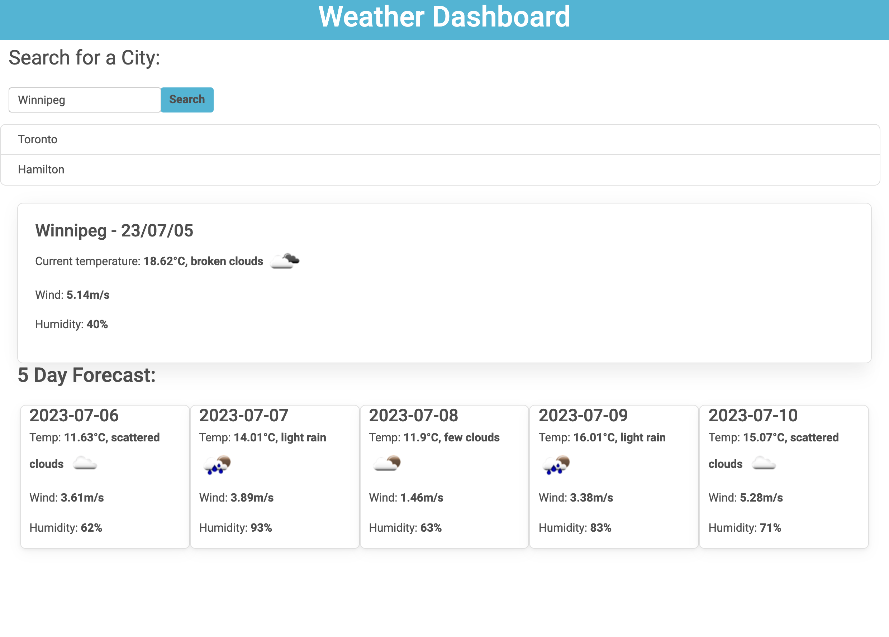

# Weather-Dashboard

## Description
This project was created without a starter code. This project takes in a user input for a city they would like to know the weather about. Then user is presented with the current weather in that city and what the next 5 days will look. 

## Live URL
https://caballero-r.github.io/Weather-Dashboard/#

## Resources Used on Project

1. Bootstrap https://mdbootstrap.com/
2. Local Storage - https://developer.mozilla.org/en-US/docs/Web/API/Window/localStorage
3. Weather Conditions Icon: https://openweathermap.org/weather-conditions
4. Weather API: https://openweathermap.org/forecast5
5. Day JS: https://day.js.org/en/

## Contributors
1. caballero-r
2. Jaytee Padilla - Tutor
3. Neil Dhand - Tutor
4. Katie Redford - Tutor
